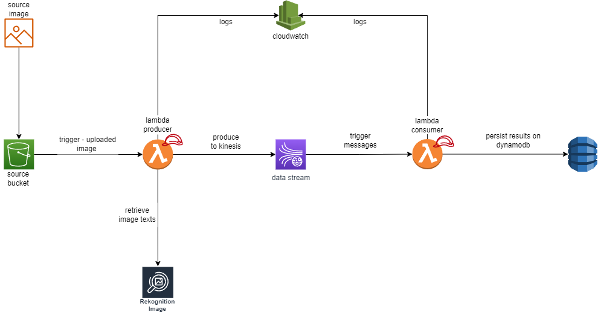

# Event Driven application for text recognition (OCR), using AWS Rekognition, AWS Kinesis and Golang

In this project, we will be using Lambda Functions to produce and consume from Kinesis Data Stream, and these functions are written in Golang.

## Description

The input of the system will be a S3 bucket, and when it receives an uploaded file it will trigger the producer Lambda Function.

This producer Lambda Function will use the image from S3 event as input to AWS Rekognition to detect texts on the image, and with the response from Rekognition the function will send these records to Kinesis Data Stream.

The Kinesis Data Stream when it will receive records from producer, it will trigger the consumer Lambda Function, which in turn it will get these records and persist them into DynamoDB.

Both the Kinesis Data Stream and the S3 Bucket are going to use encryption using AWS Managed Keys.

All the infrastructure could be deployed as code (IaC) through Terraform.

## Cloud architecture

Instructions for deploy here: [Instructions](./infrastructure/README.md)
